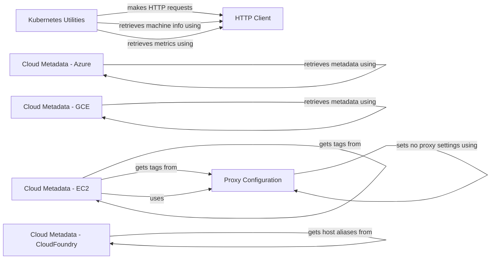

## Component Details

The Communication Infrastructure component is responsible for handling all outbound communication from the agent, primarily focusing on HTTP requests to various services, including the Datadog backend and cloud metadata providers. It ensures reliable and efficient data transmission by managing proxy settings, retrying failed requests, and handling potential errors. This component is crucial for reporting metrics, retrieving configuration updates, and gathering cloud metadata for proper agent operation and identification.

### HTTP Client
Provides utility functions for making HTTP requests, including retrieving JSON data and expvar stats. It manages proxy settings, connection pooling, and error handling to ensure reliable communication with external services.

**Related Classes/Methods**:

- `dd-agent.utils.http:get_expvar_stats` (full file reference)
- `dd-agent.utils.http.retrieve_json` (full file reference)

### Proxy Configuration
Manages proxy settings for HTTP requests, including setting no proxy settings and retrieving proxy configurations from environment variables. It ensures that the agent can communicate with external services even when behind a proxy.

**Related Classes/Methods**:

- `dd-agent.utils.proxy:set_no_proxy_settings` (full file reference)
- `dd-agent.utils.proxy.get_no_proxy_from_env` (full file reference)
- `utils.proxy.get_proxy` (full file reference)

### Cloud Metadata - EC2
Retrieves instance ID, IAM role, and tags from Amazon EC2 cloud metadata. It interacts with the Proxy Configuration component to handle proxy settings and handles cases where no IAM role is available.

**Related Classes/Methods**:

- `dd-agent.utils.cloud_metadata.EC2:get_iam_role` (full file reference)
- `dd-agent.utils.cloud_metadata.EC2:get_tags` (full file reference)
- `dd-agent.utils.cloud_metadata.EC2:get_instance_id` (full file reference)
- `dd-agent.utils.cloud_metadata.EC2.NoIAMRole` (full file reference)
- `dd-agent.utils.cloud_metadata.EC2.get_metadata` (full file reference)

### Cloud Metadata - GCE
Retrieves hostname and tags from Google Compute Engine (GCE) cloud metadata.

**Related Classes/Methods**:

- `dd-agent.utils.cloud_metadata.GCE:get_tags` (full file reference)
- `dd-agent.utils.cloud_metadata.GCE:get_hostname` (full file reference)
- `dd-agent.utils.cloud_metadata.GCE:get_host_aliases` (full file reference)
- `dd-agent.utils.cloud_metadata.GCE._get_metadata` (full file reference)

### Cloud Metadata - Azure
Responsible for retrieving host aliases from Azure cloud metadata.

**Related Classes/Methods**:

- `dd-agent.utils.cloud_metadata.Azure:get_host_aliases` (full file reference)
- `dd-agent.utils.cloud_metadata.Azure._get_metadata` (full file reference)

### Cloud Metadata - CloudFoundry
Responsible for retrieving host aliases from Cloud Foundry.

**Related Classes/Methods**:

- `dd-agent.utils.cloud_metadata.CloudFoundry:get_host_aliases` (full file reference)
- `dd-agent.utils.cloud_metadata.CloudFoundry.is_cloud_foundry` (full file reference)

### Kubernetes Utilities
Provides utility functions for interacting with Kubernetes, specifically for retrieving machine info and metrics. It uses the HTTP Client component to make HTTP requests to the Kubernetes API.

**Related Classes/Methods**:

- `dd-agent.utils.kubernetes.kubeutil.KubeUtil:retrieve_machine_info` (full file reference)
- `dd-agent.utils.kubernetes.kubeutil.KubeUtil:retrieve_metrics` (full file reference)