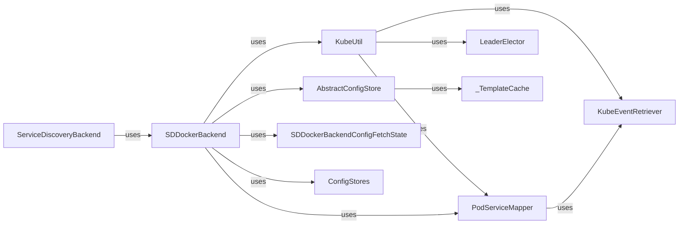

## Component Details

The Container & Orchestration Integration component provides the necessary utilities and integrations for monitoring containerized environments and interacting with orchestration platforms such as Kubernetes, Docker, and ECS. It enables the agent to discover container metadata, retrieve container statistics, and adapt to dynamic changes in the container landscape. This component is essential for monitoring modern, cloud-native applications. The core functionality revolves around discovering services, retrieving configurations, and adapting to changes in the container and orchestration landscape. It leverages various backends like Docker, Kubernetes, ZooKeeper, etcd, and Consul to achieve this.

### KubeUtil
The KubeUtil class provides utility functions for interacting with the Kubernetes API. It handles tasks such as retrieving pod lists, node information, and service mappings. It also manages authentication and authorization for accessing the Kubernetes API server. It interacts with the Kubernetes API server to retrieve information about pods, nodes, services, and events.

**Related Classes/Methods**:

- `dd-agent.utils.kubernetes.kubeutil.KubeUtil:__init__` (full file reference)
- `dd-agent.utils.kubernetes.kubeutil.KubeUtil:_init_tls_settings` (full file reference)
- `dd-agent.utils.kubernetes.kubeutil.KubeUtil:init_kubelet` (full file reference)
- `dd-agent.utils.kubernetes.kubeutil.KubeUtil:_locate_kubelet` (full file reference)
- `dd-agent.utils.kubernetes.kubeutil.KubeUtil:get_self_namespace` (full file reference)
- `dd-agent.utils.kubernetes.kubeutil.KubeUtil:get_node_hostname` (full file reference)
- `dd-agent.utils.kubernetes.kubeutil.KubeUtil:get_kube_pod_tags` (full file reference)
- `dd-agent.utils.kubernetes.kubeutil.KubeUtil:extract_kube_pod_tags` (full file reference)
- `dd-agent.utils.kubernetes.kubeutil.KubeUtil:retrieve_pods_list` (full file reference)
- `dd-agent.utils.kubernetes.kubeutil.KubeUtil:retrieve_machine_info` (full file reference)
- `dd-agent.utils.kubernetes.kubeutil.KubeUtil:retrieve_metrics` (full file reference)
- `dd-agent.utils.kubernetes.kubeutil.KubeUtil:retrieve_json_auth` (full file reference)
- `dd-agent.utils.kubernetes.kubeutil.KubeUtil:post_json_to_apiserver` (full file reference)
- `dd-agent.utils.kubernetes.kubeutil.KubeUtil:put_json_to_apiserver` (full file reference)
- `dd-agent.utils.kubernetes.kubeutil.KubeUtil:delete_to_apiserver` (full file reference)
- `dd-agent.utils.kubernetes.kubeutil.KubeUtil:get_node_info` (full file reference)
- `dd-agent.utils.kubernetes.kubeutil.KubeUtil:get_node_metadata` (full file reference)
- `dd-agent.utils.kubernetes.kubeutil.KubeUtil:get_node_hosttags` (full file reference)
- `dd-agent.utils.kubernetes.kubeutil.KubeUtil:_fetch_host_data` (full file reference)
- `dd-agent.utils.kubernetes.kubeutil.KubeUtil:match_services_for_pod` (full file reference)
- `dd-agent.utils.kubernetes.kubeutil.KubeUtil:get_event_retriever` (full file reference)
- `dd-agent.utils.kubernetes.kubeutil.KubeUtil:match_containers_for_pods` (full file reference)
- `dd-agent.utils.kubernetes.kubeutil.KubeUtil:get_pod_creator_tags` (full file reference)
- `dd-agent.utils.kubernetes.kubeutil.KubeUtil:process_events` (full file reference)
- `dd-agent.utils.kubernetes.kubeutil.KubeUtil:refresh_leader` (full file reference)

### PodServiceMapper
This class is responsible for mapping Kubernetes pods to services. It maintains a cache of services and their selectors, and it uses this cache to determine which services are associated with a given pod. It also processes Kubernetes events to keep the cache up-to-date. It interacts with the KubeUtil to retrieve pod and service information from the Kubernetes API server. It also interacts with the KubeEventRetriever to receive Kubernetes events.

**Related Classes/Methods**:

- <a href="https://github.com/DataDog/dd-agent/blob/master/utils/kubernetes/pod_service_mapper.py#L67-L105" target="_blank" rel="noopener noreferrer">`dd-agent.utils.kubernetes.pod_service_mapper.PodServiceMapper:match_services_for_pod` (67:105)</a>
- <a href="https://github.com/DataDog/dd-agent/blob/master/utils/kubernetes/pod_service_mapper.py#L123-L148" target="_blank" rel="noopener noreferrer">`dd-agent.utils.kubernetes.pod_service_mapper.PodServiceMapper:search_pods_for_service` (123:148)</a>
- <a href="https://github.com/DataDog/dd-agent/blob/master/utils/kubernetes/pod_service_mapper.py#L150-L192" target="_blank" rel="noopener noreferrer">`dd-agent.utils.kubernetes.pod_service_mapper.PodServiceMapper:process_events` (150:192)</a>

### LeaderElector
This class implements a leader election mechanism for Kubernetes. It uses a ConfigMap to coordinate the election, and it ensures that only one agent instance is elected as the leader at any given time. The leader is responsible for performing certain tasks, such as collecting cluster-level metadata. It interacts with the Kubernetes API server to create and update ConfigMaps. It also interacts with the KubeUtil to access the Kubernetes API server.

**Related Classes/Methods**:

- `dd-agent.utils.kubernetes.leader_elector.LeaderElector:__init__` (full file reference)
- `dd-agent.utils.kubernetes.leader_elector.LeaderElector:try_acquire_or_refresh` (full file reference)
- `dd-agent.utils.kubernetes.leader_elector.LeaderElector:_try_acquire` (full file reference)
- `dd-agent.utils.kubernetes.leader_elector.LeaderElector:_try_refresh` (full file reference)
- `dd-agent.utils.kubernetes.leader_elector.LeaderElector:_try_lock_cm` (full file reference)
- `dd-agent.utils.kubernetes.leader_elector.LeaderElector:_try_refresh_cm` (full file reference)

### KubeEventRetriever
This class retrieves events from the Kubernetes API server. It allows filtering events by namespace and kind, and it provides a mechanism for delaying event processing. It interacts with the Kubernetes API server to retrieve events. It also interacts with the PodServiceMapper to process events related to pods and services.

**Related Classes/Methods**:

- `dd-agent.utils.kubernetes.kube_event_retriever.KubeEventRetriever:__init__` (full file reference)

### AbstractConfigStore
This abstract class defines the interface for interacting with configuration stores. It provides methods for retrieving check configurations and templates from various sources, such as Kubernetes, Docker, and ZooKeeper. It also handles caching and invalidation of configurations. It interacts with different configuration stores (Kubernetes, Docker, ZooKeeper, etcd, Consul) to retrieve check configurations and templates.

**Related Classes/Methods**:

- <a href="https://github.com/DataDog/dd-agent/blob/master/utils/service_discovery/abstract_config_store.py#L184-L196" target="_blank" rel="noopener noreferrer">`dd-agent.utils.service_discovery.abstract_config_store.AbstractConfigStore:__init__` (184:196)</a>
- <a href="https://github.com/DataDog/dd-agent/blob/master/utils/service_discovery/abstract_config_store.py#L216-L218" target="_blank" rel="noopener noreferrer">`dd-agent.utils.service_discovery.abstract_config_store.AbstractConfigStore:_get_kube_config` (216:218)</a>
- <a href="https://github.com/DataDog/dd-agent/blob/master/utils/service_discovery/abstract_config_store.py#L220-L222" target="_blank" rel="noopener noreferrer">`dd-agent.utils.service_discovery.abstract_config_store.AbstractConfigStore:_get_docker_config` (220:222)</a>
- <a href="https://github.com/DataDog/dd-agent/blob/master/utils/service_discovery/abstract_config_store.py#L241-L262" target="_blank" rel="noopener noreferrer">`dd-agent.utils.service_discovery.abstract_config_store.AbstractConfigStore:_get_auto_config` (241:262)</a>
- <a href="https://github.com/DataDog/dd-agent/blob/master/utils/service_discovery/abstract_config_store.py#L264-L288" target="_blank" rel="noopener noreferrer">`dd-agent.utils.service_discovery.abstract_config_store.AbstractConfigStore:get_checks_to_refresh` (264:288)</a>
- <a href="https://github.com/DataDog/dd-agent/blob/master/utils/service_discovery/abstract_config_store.py#L290-L346" target="_blank" rel="noopener noreferrer">`dd-agent.utils.service_discovery.abstract_config_store.AbstractConfigStore:get_check_tpls` (290:346)</a>
- <a href="https://github.com/DataDog/dd-agent/blob/master/utils/service_discovery/abstract_config_store.py#L348-L367" target="_blank" rel="noopener noreferrer">`dd-agent.utils.service_discovery.abstract_config_store.AbstractConfigStore:read_config_from_store` (348:367)</a>
- <a href="https://github.com/DataDog/dd-agent/blob/master/utils/service_discovery/abstract_config_store.py#L389-L411" target="_blank" rel="noopener noreferrer">`dd-agent.utils.service_discovery.abstract_config_store.AbstractConfigStore:crawl_config_template` (389:411)</a>

### _TemplateCache
This class caches templates retrieved from the configuration store. It provides methods for populating the cache, retrieving templates, and invalidating the cache. It interacts with the AbstractConfigStore to retrieve templates from various sources.

**Related Classes/Methods**:

- <a href="https://github.com/DataDog/dd-agent/blob/master/utils/service_discovery/abstract_config_store.py#L55-L60" target="_blank" rel="noopener noreferrer">`dd-agent.utils.service_discovery.abstract_config_store._TemplateCache:__init__` (55:60)</a>
- <a href="https://github.com/DataDog/dd-agent/blob/master/utils/service_discovery/abstract_config_store.py#L67-L84" target="_blank" rel="noopener noreferrer">`dd-agent.utils.service_discovery.abstract_config_store._TemplateCache:_populate_auto_conf` (67:84)</a>
- <a href="https://github.com/DataDog/dd-agent/blob/master/utils/service_discovery/abstract_config_store.py#L101-L147" target="_blank" rel="noopener noreferrer">`dd-agent.utils.service_discovery.abstract_config_store._TemplateCache:get_templates` (101:147)</a>
- <a href="https://github.com/DataDog/dd-agent/blob/master/utils/service_discovery/abstract_config_store.py#L149-L174" target="_blank" rel="noopener noreferrer">`dd-agent.utils.service_discovery.abstract_config_store._TemplateCache:get_check_names` (149:174)</a>

### SDDockerBackend
This class implements the service discovery backend for Docker. It retrieves check configurations and templates from Docker containers and images. It also handles tasks such as extracting container IPs and ports, and generating tags. It interacts with the Docker API to retrieve container information. It also interacts with the AbstractConfigStore to retrieve check configurations and templates.

**Related Classes/Methods**:

- `dd-agent.utils.service_discovery.sd_docker_backend.SDDockerBackend:__init__` (full file reference)
- `dd-agent.utils.service_discovery.sd_docker_backend.SDDockerBackend:_make_fetch_state` (full file reference)
- `dd-agent.utils.service_discovery.sd_docker_backend.SDDockerBackend:update_checks` (full file reference)
- `dd-agent.utils.service_discovery.sd_docker_backend.SDDockerBackend:_get_checks_to_refresh` (full file reference)
- `dd-agent.utils.service_discovery.sd_docker_backend.SDDockerBackend:_get_host_address` (full file reference)
- `dd-agent.utils.service_discovery.sd_docker_backend.SDDockerBackend:_extract_ip_from_networks` (full file reference)
- `dd-agent.utils.service_discovery.sd_docker_backend.SDDockerBackend:_get_port` (full file reference)
- `dd-agent.utils.service_discovery.sd_docker_backend.SDDockerBackend:get_tags` (full file reference)
- `dd-agent.utils.service_discovery.sd_docker_backend.SDDockerBackend:_get_additional_tags` (full file reference)
- `dd-agent.utils.service_discovery.sd_docker_backend.SDDockerBackend:get_configs` (full file reference)
- `dd-agent.utils.service_discovery.sd_docker_backend.SDDockerBackend:_get_check_configs` (full file reference)
- `dd-agent.utils.service_discovery.sd_docker_backend.SDDockerBackend:_get_config_templates` (full file reference)

### SDDockerBackendConfigFetchState
This class represents the state of a configuration fetch operation for a Docker container. It stores information such as the container ID, the Kubernetes pod name (if applicable), and the configuration templates that have been retrieved. It interacts with the SDDockerBackend to store the state of a configuration fetch operation.

**Related Classes/Methods**:

- `dd-agent.utils.service_discovery.sd_docker_backend._SDDockerBackendConfigFetchState:get_kube_container_name` (full file reference)
- `dd-agent.utils.service_discovery.sd_docker_backend._SDDockerBackendConfigFetchState:get_kube_container_spec` (full file reference)

### ServiceDiscoveryBackend
This module provides a function for getting a service discovery backend. It interacts with the SDDockerBackend to get a service discovery backend.

**Related Classes/Methods**:

- `dd-agent.utils.service_discovery.sd_backend:get_sd_backend` (full file reference)

### ConfigStores
This module provides a function for getting a config store based on the configuration. It interacts with the ZookeeperStore, EtcdStore, and ConsulStore to get a config store based on the configuration.

**Related Classes/Methods**:

- `dd-agent.utils.service_discovery.config_stores:get_config_store` (full file reference)