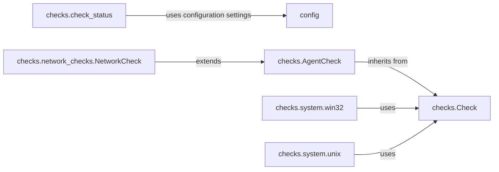

## Component Details

The Core Monitoring Framework provides the foundation for creating and running checks within the Datadog Agent. It defines base classes for checks, manages their lifecycle, and handles data collection and submission. The framework also includes functionalities for configuration loading, proxy management, service checks, and internal statistics collection, ensuring consistency and reliability across all checks.

### config
The `config` module is responsible for retrieving configuration settings, including the paths where checks are located. It determines the appropriate path based on the operating system, allowing the agent to locate and load check configurations.

**Related Classes/Methods**:

- `dd-agent.config:get_checksd_path` (full file reference)
- `dd-agent.config:get_checks_places` (full file reference)

### checks.Check
The `Check` class serves as the base class for all checks within the Datadog Agent. It provides common functionality for saving metrics (gauges, counters, samples) and managing the check lifecycle. It defines methods for submitting metrics and retrieving samples.

**Related Classes/Methods**:

- `dd-agent.checks.Check:is_gauge` (full file reference)
- `dd-agent.checks.Check:save_gauge` (full file reference)
- `dd-agent.checks.Check:save_sample` (full file reference)
- `dd-agent.checks.Check:_rate` (full file reference)
- `dd-agent.checks.Check:get_sample_with_timestamp` (full file reference)
- `dd-agent.checks.Check:get_sample` (full file reference)
- `dd-agent.checks.Check:get_samples_with_timestamps` (full file reference)
- `dd-agent.checks.Check:get_samples` (full file reference)
- `dd-agent.checks.Check:get_metrics` (full file reference)

### checks.AgentCheck
The `AgentCheck` class extends the base `Check` class and provides additional functionality specific to agent checks. This includes proxy configuration, service checks, and internal statistics collection. It serves as a base class for checks that interact with the Datadog Agent, providing methods for submitting service checks, collecting internal stats, and managing proxy settings.

**Related Classes/Methods**:

- `dd-agent.checks.AgentCheck:__init__` (full file reference)
- `dd-agent.checks.AgentCheck:get_instance_proxy` (full file reference)
- `dd-agent.checks.AgentCheck:generate_historate_func` (full file reference)
- `dd-agent.checks.AgentCheck:generate_histogram_func` (full file reference)
- `dd-agent.checks.AgentCheck:set` (full file reference)
- `dd-agent.checks.AgentCheck:service_check` (full file reference)
- `dd-agent.checks.AgentCheck:get_service_metadata` (full file reference)
- `dd-agent.checks.AgentCheck:get_library_info` (full file reference)
- `dd-agent.checks.AgentCheck:_collect_internal_stats` (full file reference)
- `dd-agent.checks.AgentCheck:run` (full file reference)
- `dd-agent.checks.AgentCheck:from_yaml` (full file reference)
- `dd-agent.checks.AgentCheck:normalize` (full file reference)

### checks.network_checks.NetworkCheck
The `NetworkCheck` class extends `AgentCheck` and provides a framework for performing network-based checks. It includes functionality for managing a pool of workers to perform network operations concurrently, allowing for efficient and scalable network monitoring.

**Related Classes/Methods**:

- `dd-agent.checks.network_checks.NetworkCheck:__init__` (full file reference)
- `dd-agent.checks.network_checks.NetworkCheck:stop` (full file reference)
- `dd-agent.checks.network_checks.NetworkCheck:start_pool` (full file reference)
- `dd-agent.checks.network_checks.NetworkCheck:restart_pool` (full file reference)
- `dd-agent.checks.network_checks.NetworkCheck:check` (full file reference)
- `dd-agent.checks.network_checks.NetworkCheck:_process` (full file reference)
- `dd-agent.checks.network_checks.NetworkCheck:_process_results` (full file reference)
- `dd-agent.checks.network_checks.NetworkCheck:_clean` (full file reference)

### checks.system.win32
The `checks.system.win32` module contains checks specific to the Windows operating system. It includes classes for monitoring CPU, memory, disk I/O, processes, and overall system status, providing insights into the performance and health of Windows systems.

**Related Classes/Methods**:

- <a href="https://github.com/DataDog/dd-agent/blob/master/checks/system/win32.py#L35-L41" target="_blank" rel="noopener noreferrer">`dd-agent.checks.system.win32.Processes:__init__` (35:41)</a>
- <a href="https://github.com/DataDog/dd-agent/blob/master/checks/system/win32.py#L43-L52" target="_blank" rel="noopener noreferrer">`dd-agent.checks.system.win32.Processes:check` (43:52)</a>
- <a href="https://github.com/DataDog/dd-agent/blob/master/checks/system/win32.py#L56-L88" target="_blank" rel="noopener noreferrer">`dd-agent.checks.system.win32.Memory:__init__` (56:88)</a>
- <a href="https://github.com/DataDog/dd-agent/blob/master/checks/system/win32.py#L90-L135" target="_blank" rel="noopener noreferrer">`dd-agent.checks.system.win32.Memory:check` (90:135)</a>
- <a href="https://github.com/DataDog/dd-agent/blob/master/checks/system/win32.py#L139-L147" target="_blank" rel="noopener noreferrer">`dd-agent.checks.system.win32.Cpu:__init__` (139:147)</a>
- <a href="https://github.com/DataDog/dd-agent/blob/master/checks/system/win32.py#L149-L159" target="_blank" rel="noopener noreferrer">`dd-agent.checks.system.win32.Cpu:check` (149:159)</a>
- <a href="https://github.com/DataDog/dd-agent/blob/master/checks/system/win32.py#L163-L176" target="_blank" rel="noopener noreferrer">`dd-agent.checks.system.win32.IO:__init__` (163:176)</a>
- <a href="https://github.com/DataDog/dd-agent/blob/master/checks/system/win32.py#L178-L214" target="_blank" rel="noopener noreferrer">`dd-agent.checks.system.win32.IO:check` (178:214)</a>
- <a href="https://github.com/DataDog/dd-agent/blob/master/checks/system/win32.py#L218-L220" target="_blank" rel="noopener noreferrer">`dd-agent.checks.system.win32.System:__init__` (218:220)</a>
- <a href="https://github.com/DataDog/dd-agent/blob/master/checks/system/win32.py#L222-L225" target="_blank" rel="noopener noreferrer">`dd-agent.checks.system.win32.System:check` (222:225)</a>

### checks.system.unix
The `checks.system.unix` module contains checks specific to Unix-like operating systems. It includes classes for monitoring CPU, memory, disk I/O, load, file handles, and overall system status, providing insights into the performance and health of Unix-like systems.

**Related Classes/Methods**:

- <a href="https://github.com/DataDog/dd-agent/blob/master/checks/system/win32.py#L163-L176" target="_blank" rel="noopener noreferrer">`dd-agent.checks.system.unix.IO:__init__` (163:176)</a>
- `dd-agent.checks.system.unix.IO:_parse_linux2` (full file reference)
- <a href="https://github.com/DataDog/dd-agent/blob/master/checks/system/win32.py#L178-L214" target="_blank" rel="noopener noreferrer">`dd-agent.checks.system.unix.IO:check` (178:214)</a>
- `dd-agent.checks.system.unix.FileHandles:check` (full file reference)
- `dd-agent.checks.system.unix.Load:check` (full file reference)
- <a href="https://github.com/DataDog/dd-agent/blob/master/checks/system/win32.py#L56-L88" target="_blank" rel="noopener noreferrer">`dd-agent.checks.system.unix.Memory:__init__` (56:88)</a>
- <a href="https://github.com/DataDog/dd-agent/blob/master/checks/system/win32.py#L90-L135" target="_blank" rel="noopener noreferrer">`dd-agent.checks.system.unix.Memory:check` (90:135)</a>
- <a href="https://github.com/DataDog/dd-agent/blob/master/checks/system/win32.py#L43-L52" target="_blank" rel="noopener noreferrer">`dd-agent.checks.system.unix.Processes:check` (43:52)</a>
- <a href="https://github.com/DataDog/dd-agent/blob/master/checks/system/win32.py#L149-L159" target="_blank" rel="noopener noreferrer">`dd-agent.checks.system.unix.Cpu:check` (149:159)</a>
- `dd-agent.checks.system.unix:main` (full file reference)

### checks.check_status
The `checks.check_status` module provides functionality for collecting and displaying the status of checks running in the agent. It includes classes for representing the status of the agent, collector, dogstatsd, and forwarder components, allowing users to monitor the health and performance of the agent and its checks.

**Related Classes/Methods**:

- `dd-agent.checks.check_status:style` (full file reference)
- `dd-agent.checks.check_status:get_ntp_info` (full file reference)
- `dd-agent.checks.check_status:validate_api_key` (full file reference)
- `dd-agent.checks.check_status.AgentStatus:persist` (full file reference)
- `dd-agent.checks.check_status.AgentStatus:render` (full file reference)
- `dd-agent.checks.check_status.AgentStatus:_header_lines` (full file reference)
- `dd-agent.checks.check_status.AgentStatus:to_dict` (full file reference)
- `dd-agent.checks.check_status.AgentStatus:_not_running_message` (full file reference)
- `dd-agent.checks.check_status.AgentStatus:remove_latest_status` (full file reference)
- `dd-agent.checks.check_status.AgentStatus:load_latest_status` (full file reference)
- `dd-agent.checks.check_status.AgentStatus:print_latest_status` (full file reference)
- `dd-agent.checks.check_status.AgentStatus:_get_pickle_path` (full file reference)
- `dd-agent.checks.check_status.CollectorStatus:__init__` (full file reference)
- `dd-agent.checks.check_status.CollectorStatus:check_status_lines` (full file reference)
- `dd-agent.checks.check_status.CollectorStatus:render_check_status` (full file reference)
- `dd-agent.checks.check_status.CollectorStatus:body_lines` (full file reference)
- `dd-agent.checks.check_status.CollectorStatus:to_dict` (full file reference)
- `dd-agent.checks.check_status.DogstatsdStatus:__init__` (full file reference)
- `dd-agent.checks.check_status.DogstatsdStatus:to_dict` (full file reference)
- `dd-agent.checks.check_status.DogstatsdStatus:_dogstatsd6_unavailable_message` (full file reference)
- `dd-agent.checks.check_status.ForwarderStatus:__init__` (full file reference)
- `dd-agent.checks.check_status.ForwarderStatus:body_lines` (full file reference)
- `dd-agent.checks.check_status.ForwarderStatus:to_dict` (full file reference)
- `dd-agent.checks.check_status:get_jmx_instance_status` (full file reference)
- `dd-agent.checks.check_status:get_jmx_status` (full file reference)