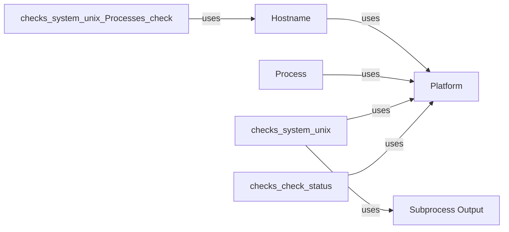

## Component Details

The Platform Abstraction Layer provides a set of platform-independent utilities and abstractions for interacting with the underlying operating system. It includes functionalities for hostname resolution, process management, subprocess execution, and other system-level operations. This layer ensures that the agent can run seamlessly on different platforms without requiring significant code changes. The main flow involves determining the current platform, retrieving the hostname, executing subprocesses, and managing processes, all while abstracting away the platform-specific details.

### Platform
Provides utility functions for determining the platform the agent is running on (e.g., Windows, Linux, macOS). It offers methods to check if the current platform is macOS, BSD, Unix, or Windows.

**Related Classes/Methods**:

- <a href="https://github.com/DataDog/dd-agent/blob/master/utils/jmx.py#L1-L40" target="_blank" rel="noopener noreferrer">`dd-agent.utils.platform.Platform` (1:40)</a>
- <a href="https://github.com/DataDog/dd-agent/blob/master/utils/jmx.py#L14-L16" target="_blank" rel="noopener noreferrer">`dd-agent.utils.platform.Platform:is_mac` (14:16)</a>
- <a href="https://github.com/DataDog/dd-agent/blob/master/utils/jmx.py#L18-L20" target="_blank" rel="noopener noreferrer">`dd-agent.utils.platform.Platform:is_bsd` (18:20)</a>
- <a href="https://github.com/DataDog/dd-agent/blob/master/utils/jmx.py#L22-L24" target="_blank" rel="noopener noreferrer">`dd-agent.utils.platform.Platform:is_unix` (22:24)</a>
- <a href="https://github.com/DataDog/dd-agent/blob/master/utils/jmx.py#L26-L28" target="_blank" rel="noopener noreferrer">`dd-agent.utils.platform.Platform:is_windows` (26:28)</a>

### Hostname
Responsible for retrieving the system's hostname from various sources, including cloud metadata services and platform-specific APIs. It uses platform-specific methods to obtain the hostname.

**Related Classes/Methods**:

- <a href="https://github.com/DataDog/dd-agent/blob/master/utils/jmx.py#L1-L147" target="_blank" rel="noopener noreferrer">`dd-agent.utils.hostname` (1:147)</a>
- <a href="https://github.com/DataDog/dd-agent/blob/master/utils/jmx.py#L41-L54" target="_blank" rel="noopener noreferrer">`dd-agent.utils.hostname:_get_hostname_unix` (41:54)</a>
- <a href="https://github.com/DataDog/dd-agent/blob/master/utils/jmx.py#L124-L147" target="_blank" rel="noopener noreferrer">`dd-agent.utils.hostname:get_hostname` (124:147)</a>

### Subprocess Output
Provides a utility function for executing subprocesses and capturing their output. It offers a method to run a command and return its output, handling potential errors.

**Related Classes/Methods**:

- <a href="https://github.com/DataDog/dd-agent/blob/master/utils/jmx.py#L1-L146" target="_blank" rel="noopener noreferrer">`dd-agent.utils.subprocess_output` (1:146)</a>
- <a href="https://github.com/DataDog/dd-agent/blob/master/utils/jmx.py#L114-L146" target="_blank" rel="noopener noreferrer">`dd-agent.utils.subprocess_output:get_subprocess_output` (114:146)</a>

### Process
Provides utility functions for working with processes, such as checking if a process exists or if the current process is the main process.

**Related Classes/Methods**:

- <a href="https://github.com/DataDog/dd-agent/blob/master/utils/jmx.py#L1-L100" target="_blank" rel="noopener noreferrer">`dd-agent.utils.process` (1:100)</a>
- <a href="https://github.com/DataDog/dd-agent/blob/master/utils/jmx.py#L44-L50" target="_blank" rel="noopener noreferrer">`dd-agent.utils.process:is_my_process` (44:50)</a>
- <a href="https://github.com/DataDog/dd-agent/blob/master/utils/jmx.py#L52-L64" target="_blank" rel="noopener noreferrer">`dd-agent.utils.process:pid_exists` (52:64)</a>