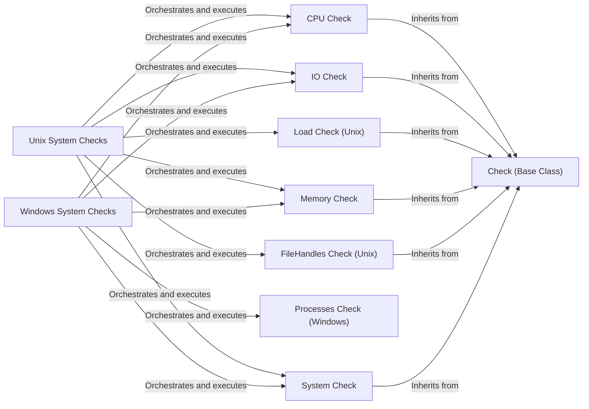

## Component Details

The System & Resource Monitoring component is responsible for collecting and reporting metrics related to system resources such as CPU, memory, disk I/O, and processes. It provides platform-specific implementations for both Windows and Unix-based systems, leveraging appropriate APIs and utilities to gather accurate and comprehensive system-level data. This component is crucial for understanding the resource utilization and performance of the monitored hosts.

### Check (Base Class)
This is a base class that provides common functionality for all checks, such as saving samples and retrieving metrics. It defines the basic structure and methods for all checks. All specific checks inherit from this class.

**Related Classes/Methods**:

- `checks.Check.save_sample` (full file reference)
- `checks.Check.get_metrics` (full file reference)
- `checks.Check.__init__` (full file reference)
- `checks.Check.gauge` (full file reference)
- `checks.Check.counter` (full file reference)
- `checks.Check.normalize_device_name` (full file reference)

### Unix System Checks
This component encompasses various system checks for Unix-based systems, including CPU, IO, Load, Memory, FileHandles, and overall System metrics. It orchestrates the execution of these checks and leverages platform-specific utilities to gather system information.

**Related Classes/Methods**:

- `dd-agent.checks.system.unix:main` (full file reference)
- <a href="https://github.com/DataDog/dd-agent/blob/master/checks/system/win32.py#L138-L159" target="_blank" rel="noopener noreferrer">`dd-agent.checks.system.unix.Cpu` (138:159)</a>
- <a href="https://github.com/DataDog/dd-agent/blob/master/checks/system/win32.py#L162-L214" target="_blank" rel="noopener noreferrer">`dd-agent.checks.system.unix.IO` (162:214)</a>
- `dd-agent.checks.system.unix.Load` (full file reference)
- <a href="https://github.com/DataDog/dd-agent/blob/master/checks/system/win32.py#L55-L135" target="_blank" rel="noopener noreferrer">`dd-agent.checks.system.unix.Memory` (55:135)</a>
- `dd-agent.checks.system.unix.FileHandles` (full file reference)
- <a href="https://github.com/DataDog/dd-agent/blob/master/checks/system/win32.py#L217-L225" target="_blank" rel="noopener noreferrer">`dd-agent.checks.system.unix.System` (217:225)</a>

### Windows System Checks
This component encompasses various system checks for Windows-based systems, including CPU, IO, Memory, Processes and overall System metrics. It orchestrates the execution of these checks and gathers system information.

**Related Classes/Methods**:

- <a href="https://github.com/DataDog/dd-agent/blob/master/checks/system/win32.py#L138-L159" target="_blank" rel="noopener noreferrer">`dd-agent.checks.system.win32.Cpu` (138:159)</a>
- <a href="https://github.com/DataDog/dd-agent/blob/master/checks/system/win32.py#L162-L214" target="_blank" rel="noopener noreferrer">`dd-agent.checks.system.win32.IO` (162:214)</a>
- <a href="https://github.com/DataDog/dd-agent/blob/master/checks/system/win32.py#L55-L135" target="_blank" rel="noopener noreferrer">`dd-agent.checks.system.win32.Memory` (55:135)</a>
- <a href="https://github.com/DataDog/dd-agent/blob/master/checks/system/win32.py#L34-L52" target="_blank" rel="noopener noreferrer">`dd-agent.checks.system.win32.Processes` (34:52)</a>
- <a href="https://github.com/DataDog/dd-agent/blob/master/checks/system/win32.py#L217-L225" target="_blank" rel="noopener noreferrer">`dd-agent.checks.system.win32.System` (217:225)</a>

### CPU Check
This component is responsible for collecting and formatting CPU metrics. It uses platform-specific methods to gather raw CPU data, calculates CPU utilization percentages, and formats the results for reporting.

**Related Classes/Methods**:

- <a href="https://github.com/DataDog/dd-agent/blob/master/checks/system/win32.py#L149-L159" target="_blank" rel="noopener noreferrer">`dd-agent.checks.system.unix.Cpu:check` (149:159)</a>
- `dd-agent.checks.system.unix.Cpu.check.get_value` (full file reference)
- `dd-agent.checks.system.unix.Cpu.check.format_results` (full file reference)
- <a href="https://github.com/DataDog/dd-agent/blob/master/checks/system/win32.py#L149-L159" target="_blank" rel="noopener noreferrer">`dd-agent.checks.system.win32.Cpu:check` (149:159)</a>

### IO Check
This component gathers I/O metrics. It uses platform-specific methods (e.g., parsing /proc/diskstats on Linux or using Windows APIs) to collect disk I/O statistics and calculates I/O utilization.

**Related Classes/Methods**:

- <a href="https://github.com/DataDog/dd-agent/blob/master/checks/system/win32.py#L178-L214" target="_blank" rel="noopener noreferrer">`dd-agent.checks.system.unix.IO:check` (178:214)</a>
- `dd-agent.checks.system.unix.IO._parse_linux2` (full file reference)
- `dd-agent.checks.system.unix.IO._cap_io_util_value` (full file reference)
- `dd-agent.checks.system.unix.IO._parse_darwin` (full file reference)
- <a href="https://github.com/DataDog/dd-agent/blob/master/checks/system/win32.py#L178-L214" target="_blank" rel="noopener noreferrer">`dd-agent.checks.system.win32.IO:check` (178:214)</a>
- <a href="https://github.com/DataDog/dd-agent/blob/master/checks/system/win32.py#L29-L31" target="_blank" rel="noopener noreferrer">`dd-agent.checks.system.win32.should_ignore_disk` (29:31)</a>

### Load Check (Unix)
This component is responsible for collecting system load metrics on Unix systems. It executes a subprocess command to retrieve load average values.

**Related Classes/Methods**:

- `dd-agent.checks.system.unix.Load:check` (full file reference)

### Memory Check
This component gathers memory metrics. It uses platform-specific calls to obtain memory statistics and calculates memory usage percentages.

**Related Classes/Methods**:

- <a href="https://github.com/DataDog/dd-agent/blob/master/checks/system/win32.py#L90-L135" target="_blank" rel="noopener noreferrer">`dd-agent.checks.system.unix.Memory:check` (90:135)</a>
- <a href="https://github.com/DataDog/dd-agent/blob/master/checks/system/win32.py#L90-L135" target="_blank" rel="noopener noreferrer">`dd-agent.checks.system.win32.Memory:check` (90:135)</a>

### FileHandles Check (Unix)
This component checks the number of open file handles on Unix systems.

**Related Classes/Methods**:

- `dd-agent.checks.system.unix.FileHandles:check` (full file reference)

### Processes Check (Windows)
This component gathers process related metrics on Windows systems.

**Related Classes/Methods**:

- <a href="https://github.com/DataDog/dd-agent/blob/master/checks/system/win32.py#L43-L52" target="_blank" rel="noopener noreferrer">`dd-agent.checks.system.win32.Processes:check` (43:52)</a>

### System Check
This component gathers overall system metrics on both Unix and Windows systems.

**Related Classes/Methods**:

- <a href="https://github.com/DataDog/dd-agent/blob/master/checks/system/win32.py#L222-L225" target="_blank" rel="noopener noreferrer">`dd-agent.checks.system.unix.System:check` (222:225)</a>
- <a href="https://github.com/DataDog/dd-agent/blob/master/checks/system/win32.py#L222-L225" target="_blank" rel="noopener noreferrer">`dd-agent.checks.system.win32.System:check` (222:225)</a>