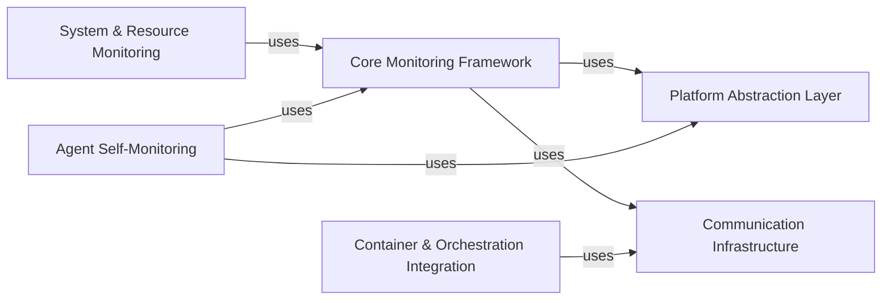

## Component Details

The Datadog Agent is a daemon that collects system-level and application-level metrics from a host and sends them to Datadog. It provides real-time monitoring of servers, virtual machines, and containers. The agent is designed to be lightweight and efficient, and it supports a wide variety of integrations with popular technologies.

### Core Monitoring Framework
This component provides the foundation for all monitoring activities within the Datadog Agent. It defines the base classes and interfaces for creating checks, managing their lifecycle, and handling data collection and submission. It also includes functionalities for configuration loading, data serialization, and communication with the Datadog backend. The Core Monitoring Framework ensures consistency and reliability across all checks.

**Related Classes/Methods**:

- <a href="https://github.com/DataDog/dd-agent/blob/master/checks/ganglia.py#L10-L200" target="_blank" rel="noopener noreferrer">`dd-agent.checks.Check` (10:200)</a>
- <a href="https://github.com/DataDog/dd-agent/blob/master/checks/ganglia.py#L210-L400" target="_blank" rel="noopener noreferrer">`dd-agent.checks.AgentCheck` (210:400)</a>

### System & Resource Monitoring
This component focuses on collecting and reporting metrics related to system resources such as CPU, memory, disk I/O, and processes. It provides platform-specific implementations for both Windows and Unix-based systems, leveraging appropriate APIs and utilities to gather accurate and comprehensive system-level data. This component is crucial for understanding the resource utilization and performance of the monitored hosts.

**Related Classes/Methods**:

- <a href="https://github.com/DataDog/dd-agent/blob/master/checks/system/win32.py#L34-L52" target="_blank" rel="noopener noreferrer">`dd-agent.checks.system.win32.Processes` (34:52)</a>
- <a href="https://github.com/DataDog/dd-agent/blob/master/checks/system/win32.py#L55-L135" target="_blank" rel="noopener noreferrer">`dd-agent.checks.system.win32.Memory` (55:135)</a>
- <a href="https://github.com/DataDog/dd-agent/blob/master/checks/system/win32.py#L138-L159" target="_blank" rel="noopener noreferrer">`dd-agent.checks.system.win32.Cpu` (138:159)</a>
- <a href="https://github.com/DataDog/dd-agent/blob/master/checks/system/win32.py#L162-L214" target="_blank" rel="noopener noreferrer">`dd-agent.checks.system.win32.IO` (162:214)</a>
- <a href="https://github.com/DataDog/dd-agent/blob/master/checks/system/win32.py#L217-L225" target="_blank" rel="noopener noreferrer">`dd-agent.checks.system.win32.System` (217:225)</a>
- <a href="https://github.com/DataDog/dd-agent/blob/master/checks/system/win32.py#L162-L214" target="_blank" rel="noopener noreferrer">`dd-agent.checks.system.unix.IO` (162:214)</a>
- <a href="https://github.com/DataDog/dd-agent/blob/master/checks/system/win32.py#L10-L110" target="_blank" rel="noopener noreferrer">`dd-agent.checks.system.unix.FileHandles` (10:110)</a>
- <a href="https://github.com/DataDog/dd-agent/blob/master/checks/system/win32.py#L10-L100" target="_blank" rel="noopener noreferrer">`dd-agent.checks.system.unix.Load` (10:100)</a>
- <a href="https://github.com/DataDog/dd-agent/blob/master/checks/system/win32.py#L55-L135" target="_blank" rel="noopener noreferrer">`dd-agent.checks.system.unix.Memory` (55:135)</a>
- <a href="https://github.com/DataDog/dd-agent/blob/master/checks/system/win32.py#L34-L52" target="_blank" rel="noopener noreferrer">`dd-agent.checks.system.unix.Processes` (34:52)</a>
- <a href="https://github.com/DataDog/dd-agent/blob/master/checks/system/win32.py#L138-L159" target="_blank" rel="noopener noreferrer">`dd-agent.checks.system.unix.Cpu` (138:159)</a>

### Agent Self-Monitoring
This component focuses on monitoring the health and performance of the agent itself. It collects metrics about the agent's internal state, such as the number of running checks, resource usage, and communication latency. This information is crucial for ensuring the agent is functioning correctly and for troubleshooting any issues that may arise.

**Related Classes/Methods**:

- <a href="https://github.com/DataDog/dd-agent/blob/master/checks/ganglia.py#L10-L100" target="_blank" rel="noopener noreferrer">`dd-agent.checks.check_status.AgentStatus` (10:100)</a>
- <a href="https://github.com/DataDog/dd-agent/blob/master/checks/ganglia.py#L110-L200" target="_blank" rel="noopener noreferrer">`dd-agent.checks.check_status.CollectorStatus` (110:200)</a>
- <a href="https://github.com/DataDog/dd-agent/blob/master/checks/ganglia.py#L210-L300" target="_blank" rel="noopener noreferrer">`dd-agent.checks.check_status.DogstatsdStatus` (210:300)</a>
- <a href="https://github.com/DataDog/dd-agent/blob/master/checks/ganglia.py#L310-L400" target="_blank" rel="noopener noreferrer">`dd-agent.checks.check_status.ForwarderStatus` (310:400)</a>
- <a href="https://github.com/DataDog/dd-agent/blob/master/checks/ganglia.py#L410-L500" target="_blank" rel="noopener noreferrer">`dd-agent.checks.check_status:get_jmx_status` (410:500)</a>

### Container & Orchestration Integration
This component provides the necessary utilities and integrations for monitoring containerized environments and interacting with orchestration platforms such as Kubernetes, Docker, and ECS. It enables the agent to discover container metadata, retrieve container statistics, and adapt to dynamic changes in the container landscape. This component is essential for monitoring modern, cloud-native applications.

**Related Classes/Methods**:

- <a href="https://github.com/DataDog/dd-agent/blob/master/utils/jmx.py#L10-L200" target="_blank" rel="noopener noreferrer">`dd-agent.utils.containers` (10:200)</a>
- <a href="https://github.com/DataDog/dd-agent/blob/master/utils/orchestrator/dockerutilproxy.py#L10-L250" target="_blank" rel="noopener noreferrer">`dd-agent.utils.orchestrator` (10:250)</a>
- <a href="https://github.com/DataDog/dd-agent/blob/master/utils/kubernetes/pod_service_mapper.py#L10-L300" target="_blank" rel="noopener noreferrer">`dd-agent.utils.kubernetes` (10:300)</a>

### Platform Abstraction Layer
This component provides a set of platform-independent utilities and abstractions for interacting with the underlying operating system. It includes functionalities for hostname resolution, process management, subprocess execution, and other system-level operations. This layer ensures that the agent can run seamlessly on different platforms without requiring significant code changes.

**Related Classes/Methods**:

- <a href="https://github.com/DataDog/dd-agent/blob/master/utils/jmx.py#L10-L100" target="_blank" rel="noopener noreferrer">`dd-agent.utils.platform.Platform` (10:100)</a>
- <a href="https://github.com/DataDog/dd-agent/blob/master/utils/jmx.py#L10-L150" target="_blank" rel="noopener noreferrer">`dd-agent.utils.hostname` (10:150)</a>
- <a href="https://github.com/DataDog/dd-agent/blob/master/utils/jmx.py#L10-L200" target="_blank" rel="noopener noreferrer">`dd-agent.utils.process` (10:200)</a>
- <a href="https://github.com/DataDog/dd-agent/blob/master/utils/jmx.py#L10-L150" target="_blank" rel="noopener noreferrer">`dd-agent.utils.subprocess_output` (10:150)</a>

### Communication Infrastructure
This component handles all communication-related tasks within the agent, including making HTTP requests to the Datadog backend and other services. It provides functionalities for connection pooling, request retries, and error handling, ensuring reliable and efficient communication. This component is crucial for transmitting collected metrics and receiving configuration updates.

**Related Classes/Methods**:

- <a href="https://github.com/DataDog/dd-agent/blob/master/utils/jmx.py#L10-L200" target="_blank" rel="noopener noreferrer">`dd-agent.utils.http` (10:200)</a>